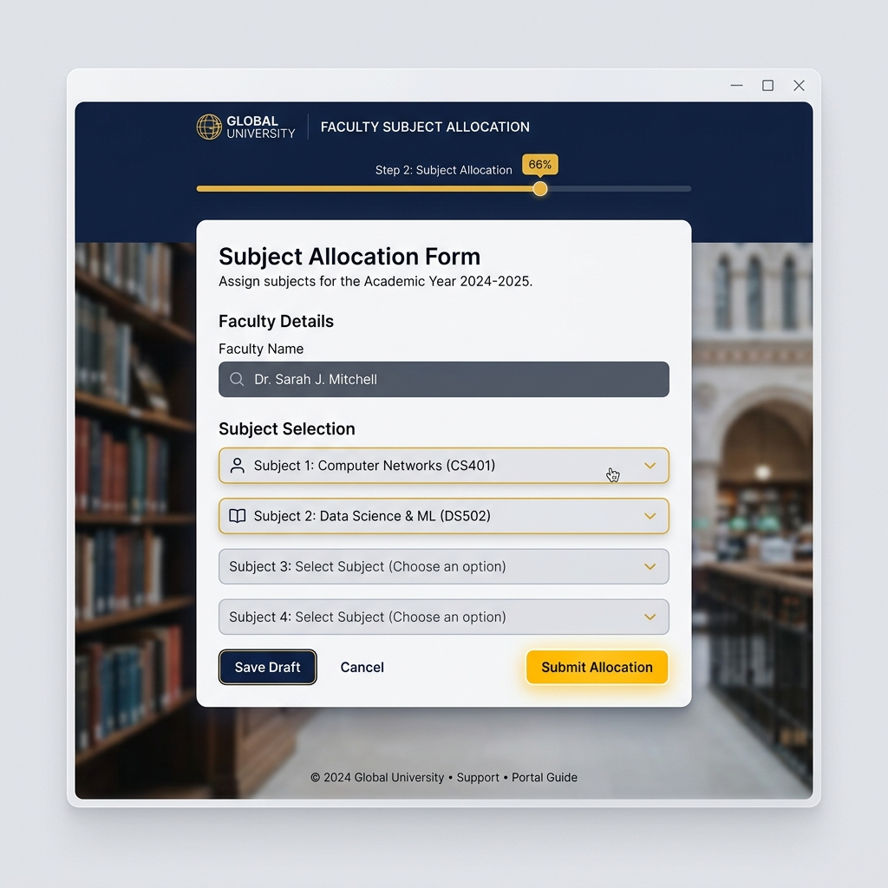
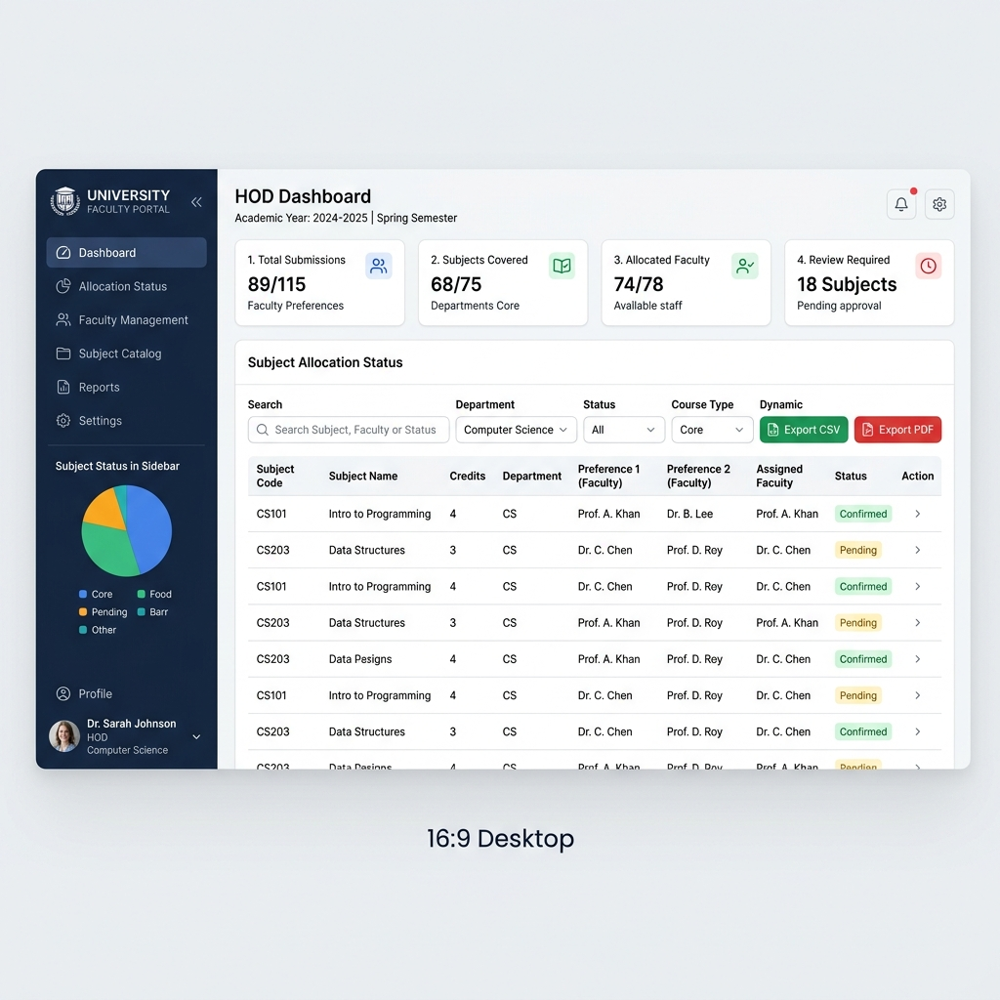

# Faculty Subject Allocation System — Brainware University


[](https://www.php.net/)
[](https://opensource.org/licenses/MIT)
[]()
[](https://infinityfree.net/)

The **Faculty Subject Allocation System** is a streamlined, web-based platform designed for Brainware University's Computational Sciences Department. It allows faculty members to submit their subject preferences for the upcoming academic year and provides a secure dashboard for the Head of Department (HOD) to manage, filter, and export allocation data.

---

## 📸 UI Showcase

| Faculty Submission Form | HOD Management Dashboard |
| :---: | :---: |
|  |  |
| *Clean, validation-ready interface for faculty selections.* | *Advanced filtering, stats, and export capabilities for administration.* |

---

## 🚀 Key Features

- **✅ Smart Validation**: Prevents duplicate subject selections and duplicate faculty entries.
- **📊 Real-time Stats**: HOD dashboard provides instant metrics on total submissions and subject coverage.
- **🔍 Advanced Filtering**: Search and filter allocations by faculty name or specific subjects.
- **📥 Multi-format Export**: Download allocation reports in **CSV**, **Excel**, or professionally formatted **PDF**.
- **📱 Responsive Design**: Fully optimized for mobile, tablet, and desktop viewing.
- **⚙️ Auto-Setup**: Database and tables are automatically initialized on the first run.

---

## 🛠️ Technology Stack

- **Frontend**: HTML5, Vanilla CSS3 (Custom Design System), JavaScript (ES6+)
- **Backend**: PHP 7.4+ / 8.x
- **Database**: MySQL / MariaDB
- **Libraries**: [FPDF](http://www.fpdf.org/) (for PDF generation)

---

## 📂 Project Structure

```bash
brainware-faculty/
├── index.php              # Faculty preference submission form
├── landing.php            # Post-submission confirmation page
├── submit.php             # Backend logic for form processing
├── hod-dashboard.php      # HOD administrative panel (secure)
├── db.php                 # Database connection & auto-migration
├── export-csv.php         # CSV data extraction logic
├── export-excel.php       # Excel spreadsheet generator
├── assets/                # CSS, JS, and documentation assets
│   ├── docs/              # README images and mockups
│   ├── style.css          # Main application stylesheet
│   └── form.js            # Frontend interactivity
└── fpdf/                  # PDF generation library
```

---

## 💻 Local Setup (XAMPP)

1. **Clone the Project**:
   ```bash
   git clone https://github.com/EL-STRIX/Faculty-Subject-Allocation.git
   ```
2. **Move to htdocs**:
   Place the project folder in `C:\xampp\htdocs\brainware-faculty\`.
3. **Start XAMPP**:
   Ensure **Apache** and **MySQL** are running in your XAMPP Control Panel.
4. **Access the App**:
   Navigate to `http://localhost/brainware-faculty/`.
   *Note: The database `brainware_faculty` will be created automatically.*

---

## 🌐 Production Deployment

The project is currently configured for deployment on **InfinityFree**. Ensure your `db.php` is updated with your hosting credentials:

```php
define('DB_HOST', 'your_infinityfree_sql_host');
define('DB_USER', 'your_username');
define('DB_PASS', 'your_password');
define('DB_NAME', 'your_database_name');
```

---

## 🔐 Administrative Access

Access the HOD panel to view and manage all submissions.

- **URL**: `http://your-domain.com/hod-dashboard.php`
- **Default Password**: `brainware@hod`

---

## 📄 License

Distributed under the MIT License. See `LICENSE` for more information.

---

<div align="center">
  <p><i>Computational Sciences Department — Brainware University</i></p>
  <p><b>Academic Year 2025–2026</b></p>
</div>
